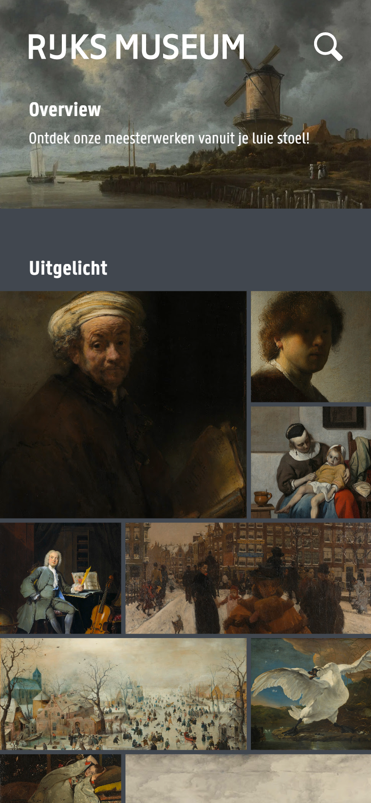
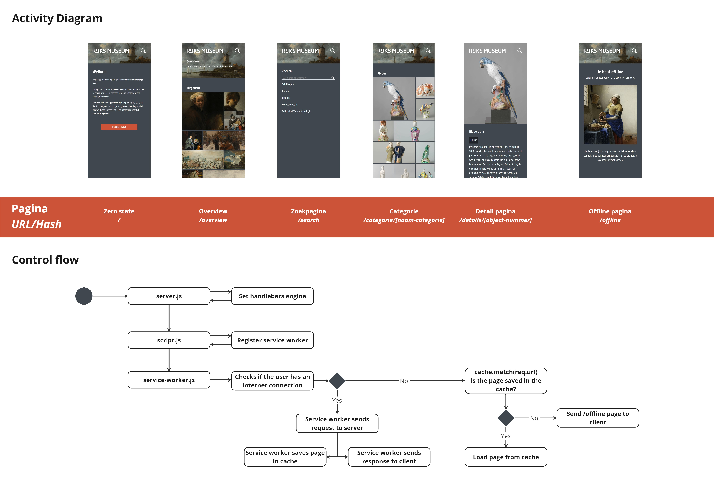

# :art:Rijksmuseum | Progressive Web Apps
The web application is a Single Page Application (SPA) that allows users to search for and view artwork from the Rijksmuseum in Amsterdam, Netherlands.




<!-- LINKJE -->

## :card_file_box:Table of contents
* [User story](#busts_in_silhouetteuser-story)
* [Features](#sparklesfeatures)
* [Done during this course](#white_check_markdone-during-this-course)
* [Install and Run the project](#rocketinstall-and-run-the-project)
* [Rendering Choices](#fork_and_kniferendering_choices)
* [Enhancements](#wrenchenhancements)
* [API](#bulbapi)
* [Author](#technologistauthor)
* [License](#page_facing_uplicense)

## :busts_in_silhouette:User story
As an art lover, I want to be able to search and view art from the Rijksmuseum at home so that I can enjoy art at all times.

## :sparkles:Features
- [X] Overview of different artworks
- [X] Detail page of a single artwork
- [X] Filter artworks based on category
- [ ] Search bar for searching artworks based on object number, title of artwork or artist


## :white_check_mark:Done during this course
- [X] Redesign WAFS app and change the app structure
- [X] Convert the client-side rendered app to a server-side rendered app
    - [X] Convert app to Node.js
    - [X] Use Express to create a server
    - [X] Use Handlebars to render pages
    - [X] Add a service worker
        - [X] Make caching work
        - [X] Make the app work offline
    - [X] Add a manifest file
- [X] Add progressive enhancement
- [X] Optimize performance
    - [X] Optimize images
    - [X] Optimize CSS by minifying
    - [X] Add cache-control
- [X] Deploy the app


## :rocket:Install and Run the project
To use this app, you will have to clone this repo. You can do this by typing the following command in your terminal:

```
git clone https://github.com/PipHarsveld/progressive-web-app
```

Atfer cloning the repo, you will have to install the dependencies. You can do this by typing the following command in your terminal:

```
npm install
```

To get the data from the Rijksmuseum API, you'll need a API key. To get this, make an account on the [Rijksmuseum API website](https://data.rijksmuseum.nl/object-metadata/api/). After you've made an account, you can get your API key by clicking on the 'Get your key' button. Create a .env file, copy the API key and paste it in the .env file.

Once the dependencies are installed, you can direct to the project folder with this command:

```
cd progressive-web-app
```

For the final step, run the project by typing the following command in your terminal:

```
npm run dev
```

Congrats, you are now all set! Go to `http://localhost:5000/` and enjoy RijksKunst!

## :fork_and_knife:Rendering choices
Client-side rendering and server-side rendering are two approaches used to display web content. With client-side rendering, the web browser requests data from the server and then uses JavaScript to generate and display the HTML. Server-side rendering, on the other hand, is when the server generates the HTML for a webpage and sends it to the client. 
There are a few adventages to using server-side rendering. It can improve search engine optimization, provide faster page loading times, and improve the user experience. By rendering the pages on the server-side, the HTML content is generated on the server and sent to the client as a complete webpage. This reduces the amount of work that needs to be done on the client-side, resulting in a faster and smoother user experience.

I implemented server-side rendering in my project using Express and Handlebars. 
I created a file called router.js in my router directory to render different pages. In the router.js file, I defined different routes using the router.get() method to render the respective pages. For example, the /overview route fetches data from the Rijksmuseum API using the request() method and passes it to the overview view using Handlebars template engine. Similarly, the /details/:id route fetches data for a specific art object based on the ID passed in the URL parameter, and the /categorie/:type route fetches data for a specific art category.

### Caching
I used a service worker to cache my app's assets and visited pages, enabling my PWA to load faster even when offline. I registerd my service worker in my app.js file, which means that the service worker will be registered when the user visits the app for the first time:
``` js	
window.addEventListener("load", () => {
    if ("serviceWorker" in navigator) {
      navigator.serviceWorker.register("/service-worker.js");
      console.log("Service worker registered!")
    }
  });
```
See my service worker file [here](https://github.com/PipHarsveld/progressive-web-app/blob/main/service-worker.js) to see how I implemented it (service-worker.js).


## :wrench:Enhancements
Before I began enhancing my PWA, I ran a Lighthouse audit to see how my PWA performed. The results of the audit are shown below:


As you can see, I can improve my performance, accessibility and SEO. Also, I have no check mark for PWA, which I also want to fix.

In order to improve these things, I have implemented several enhancements to optimize the critical render path. These enhancements include:


### Minification CSS
To reduce the size of my app's assets, I have minified my CSS file, resulting in faster loading times. I used the npm package [css-minify](https://www.npmjs.com/package/css-minify) to minify my CSS file. You can downlaod the package by typing the following command in your terminal:
``` bash
npm install css-minify -g
```
After installing the package, you can minify your CSS file by typing the following command in your terminal:
``` bash
css-minify -f filename
```

### Lazy loading of images 
The images in my app are quite large, which means that they take a long time to load. This was the main reason why my app had not the best performance score. To improve the performance of my app, I have implemented lazy loading of images using the `loading="lazy"` attribute in the img tag. This means that the images only load when they are needed, thus improving the initial loading time of my PWA.

``` html

```

### Cache-control 
I've used the Cache-Control HTTP header to set the cache duration for my app's assets to one year, which means that the browser will deliver the assets from the cache after a year. Shown below is the code I used to set the cache duration:
``` js
app.use((req, res, next) => {
    res.setHeader('Cache-Control', 'max-age=' + 60 * 60 * 24 * 365);
    next();
});
```

### Maskable image
In order to get my PWA to pass the PWA audit, I have added a maskable image to my manifest. Showing below is the code I used to add a maskable image to my app:
``` js
    "icons": [
      {
        "src": "images/icon-144x144.png",
        "type": "image/png",
        "sizes": "144x144",
        "purpose": "any maskable"
      },
```

### Touch icon
I have added a apple touch icon to my app by adding the following code to my index.html file:
``` html
<link rel="apple-touch-icon" href="/static/images/icon-192x192.png">
```

### Theme color
In order to get my PWA to pass the PWA audit, I have added a theme color to my app. I have added the following code to my index.html file:
``` html
<meta name="theme-color" content="#40474F"/>
```

### Meta description
I have added a meta description to my app by adding the following code to my index.html file:
``` html
<meta name="description"
        content="Met de webapp van Rijkskunst kan je de kunstwerken uit het Rijksmuseum bekijken waar en wanneer je maar wilt!">
```

### Eliminate render-blocking
I have used the `defer` attribute in the script tag to eliminate render-blocking. This means that the script will be executed after the page has been loaded, which improves the perceived performance of my PWA.
``` html
<script src="/scripts/script.js" defer></script>
```

### Block font loading and font rendering controls
To optimize the font loading process, I have used the `font-display: swap` CSS property, which tells the browser to display fallback fonts until the custom fonts are loaded. This prevents layout shifts and improves the perceived performance of my PWA.
``` css
@font-face {
    font-family: 'Panno';
    src: url(../fonts/PannoText-Normal.woff) format('woff'),
        url(../fonts/PannoText-Normal.woff2) format('woff2');
    font-weight: 400;
    font-display: swap;
}

@font-face {
    font-family: 'Panno';
    src: url(../fonts/PannoText-Bold.woff) format('woff'),
        url(../fonts/PannoText-Bold.woff2) format('woff2');
    font-weight: 700;
    font-display: swap;
}
```

### Conclusion
By implementing these enhancements, I have optimized the critical render path of my PWA, resulting in a better user experience for my app's users. I have also improved the performance, accessibility and SEO of my PWA. The results of the Lighthouse audit after implementing these enhancements are shown below:


## :chart_with_upwards_trend:Activity diagram



## :bulb:Api
I used the Rijksmuseum API for this project and before I started, I did some research to the API. The Rijksmuseum API is a public API provided by the Rijksmuseum in Amsterdam, which allows developers to access and use data about the museum's collections. The API provides access to a large number of images and metadata for artworks, along with other information such as artist biographies and collection highlights. If you would like to know more about the API, you can visit the [Rijksmuseum API documentation](https://data.rijksmuseum.nl/object-metadata/api/) or read my [research](https://github.com/PipHarsveld/rijksmuseum/wiki/Analyseren).


<!-- ## :ledger:Sources
https://levelup.gitconnected.com/set-up-and-run-a-simple-node-server-project-38b403a3dc09 -->


## :technologist:Author
This project is designed and created by [Pip Harsveld](https://github.com/PipHarsveld) for the course WebApp From Scratch in the minor Webdesign and Development.


## :page_facing_up:License
Copyright © 2023 Pip Harsveld.

This project is [MIT](https://github.com/PipHarsveld/rijksmuseum/blob/main/LICENSE) licensed.
